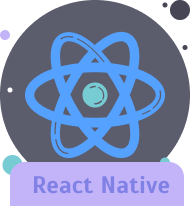

<h3>Hi, &nbsp;</h3>

I am a Software Engineer, Expert in front-end development (mobile applications📱 and web applications 💻), I'm also working on back-end RESTful API (node js).

🎉 Also have good experience in MERN stack development.

- 🔭 I’m currently contributing in [WebHR](https://web.hr/), [HireSide](https://hireside.com/) and [GotoCampus](https://gotocampus.com/)

- 🖥 I’m currently learning **Flutter**

- 💬 Ask me about **React Native, ReactJS**

- 📫 How to reach me **nasirabbasi534@gmail.com**

 

 
                      

<i><b>Currently Working and Learning:</b></i> 
    
  &nbsp;
  &nbsp;
  &nbsp;
    &nbsp;
  &nbsp;

<i><b>Tools known:</b></i> 
    
   &nbsp;
  &nbsp;
  &nbsp;
 &nbsp;
  &nbsp;
  &nbsp;

<!--
**NasirAbbasi1/NasirAbbasi1** is a ✨ _special_ ✨ repository because its `README.md` (this file) appears on your GitHub profile.

Here are some ideas to get you started:

- 🔭 I’m currently working on ...
- 🌱 I’m currently learning ...
- 👯 I’m looking to collaborate on ...
- 🤔 I’m looking for help with ...
- 💬 Ask me about ...
- 📫 How to reach me: ...
- 😄 Pronouns: ...
- ⚡ Fun fact: ...
  -->
